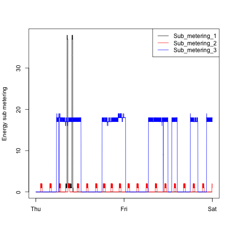

## Exploratory Data Analysis - Course Project 1.

This is my submission for course project 1. As outlined in README_ORIG.md, the goal is to create 4 plots using PNG as a graphing device. 

Each plot has a corresponding R script that generates the plot. 

For example, plot1.R generates plot1.png and so on.

Steps taken by each R Script

- Download the "Individual household electric power consumption Data Set" to current working directory
- Unzip the download to the current working directory
- Read the whole dataset into a data frame
- Subset the dataframe as we're only interested in dates 2007-02-01 and 2007-02-02
- Select PNG as a graphics device
- Use the base plotting system to generate the plot
- Close the graphics device

## Plots generated

### plot1.png

### plot2.png

### plot3.png

### plot4.png

## Contributors

Leo Deza - Submission to course project 1
